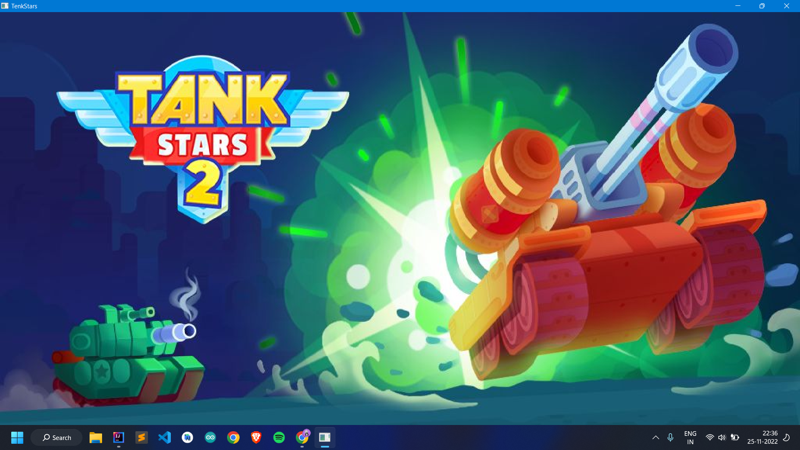
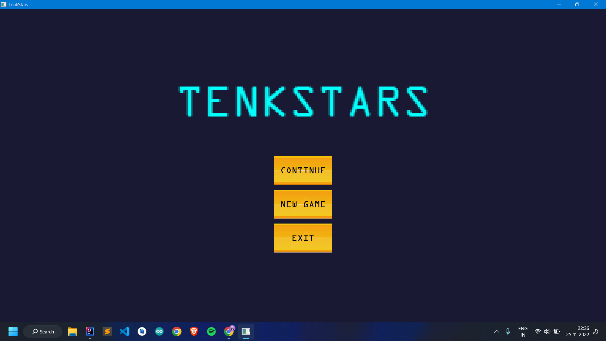
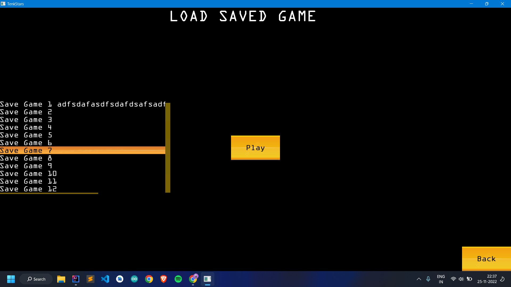
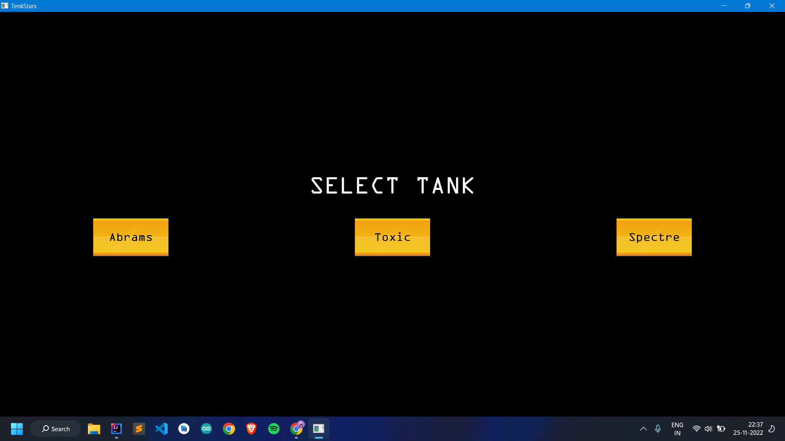
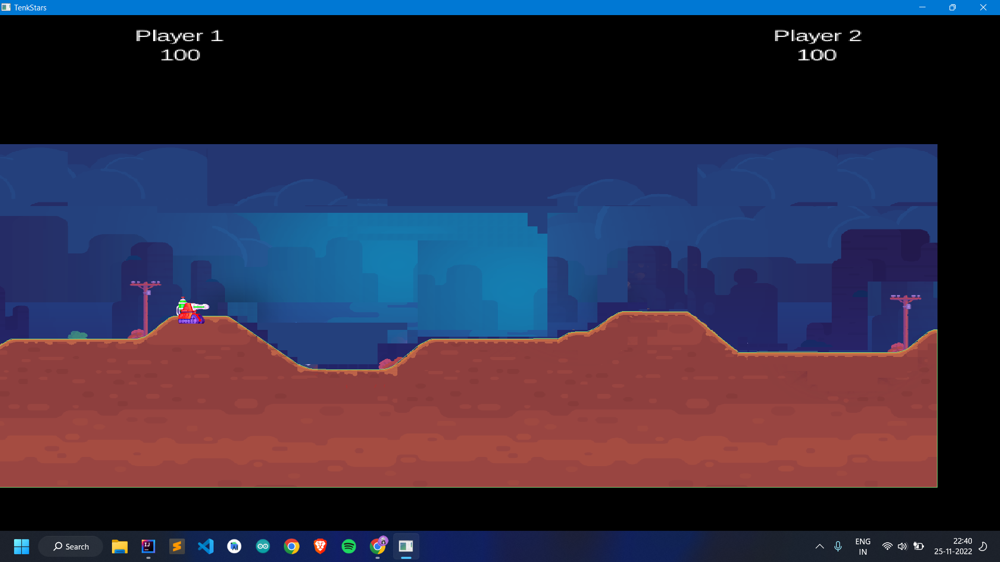
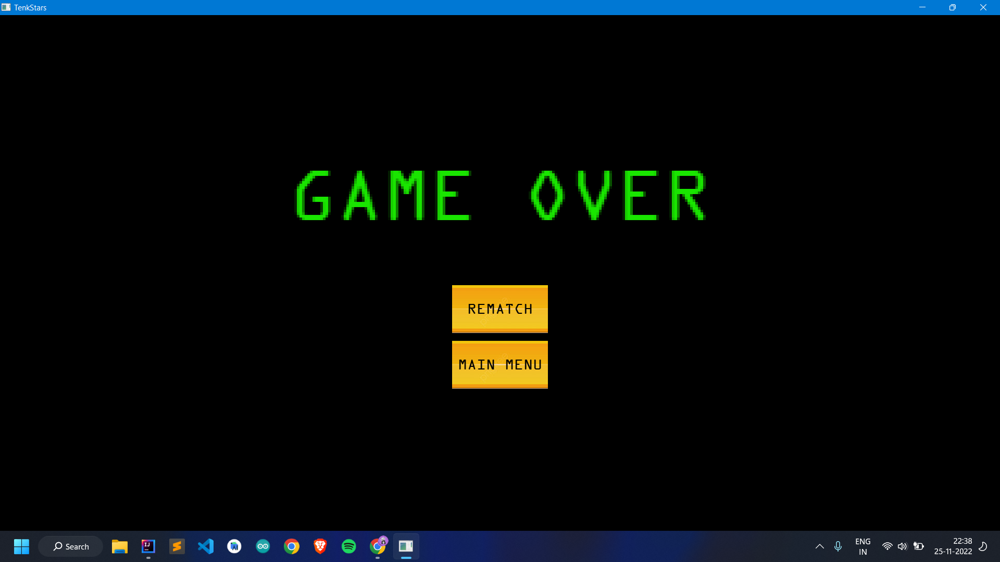

<h1>TenkStars</h1>

This project is a clone of the popular game "TankStars" implemented in Java using the LibGDX framework.

## Overview

TankStars is a turn-based artillery game where players control tanks and engage in battles. The objective is to strategically aim and fire projectiles at opponents to eliminate their tanks while protecting your own.

## Features

- Player vs. Player (PvP) gameplay.
- win/loss conditions.
- Save game/Load game
  
## Controls

- Use A/D to move the tanks.
- Use Enter to fire

## Screenshots

## Prerequisites

To run the game, you need to have the following installed:

- Java Development Kit (JDK) version 8 or above.
- Gradle build tool.

## UML Diagram

## Acknowledgments

- The TankStars game, which inspired this clone.
- The LibGDX framework and its community for providing the tools and resources.
